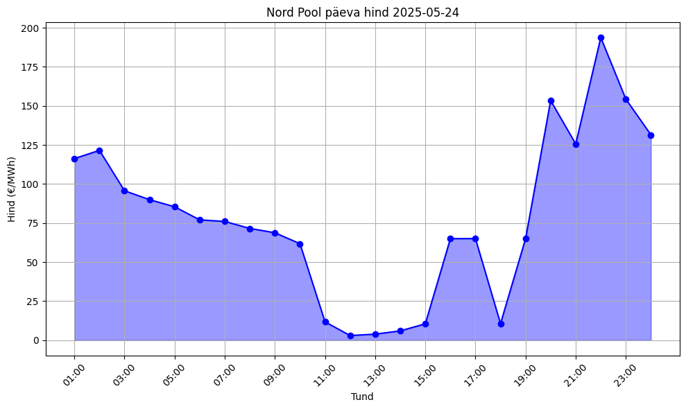
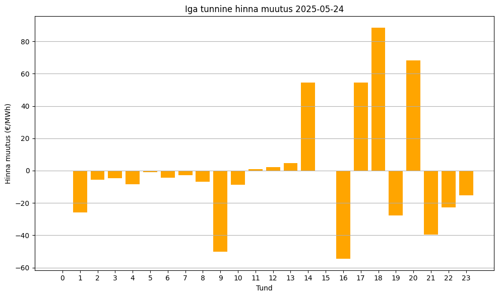
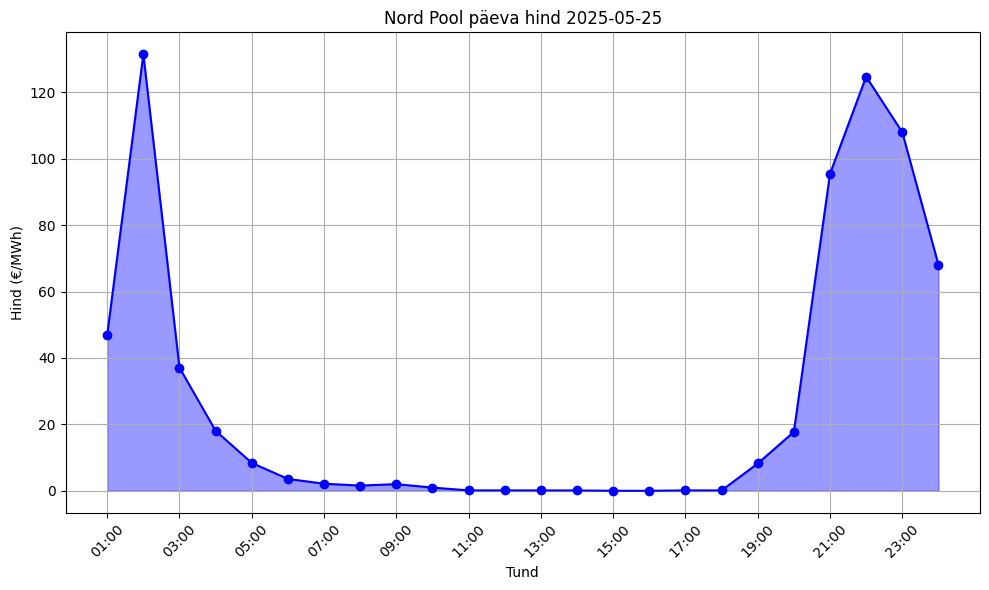
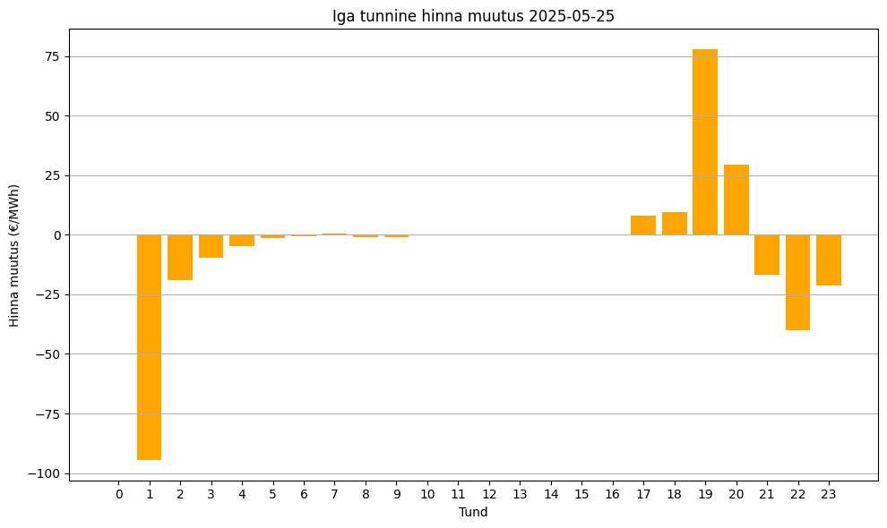

# Andmete analüüs

Kasutan oma analüüsi jaoks kahe päeva tulemusi, et saada rohkem andmeid ja näitada korduvust.

Mõlemas päevahinna graafis on näha sarnast mustrit, kus varahommikul ja öösetel aegadel on näha märkimisväärselt suuremat hinda.

Vaadates muudatust teistel graafidelt tundide vahel, on näha, et umbes kella 1st hakkab hind langema ja ei tõuse kordagi, kuni keskpäevani või õhtuni mil hind nö "lendab lakke".

# Töö kirjeldus
Alustasin HTML lehe analüüsiga. Kuna leht on dünaamiline, proovisin leida kohta kust saaks andmeid kätte. Leides üles viisi kuidas andmeid kätte saada, hakkasin lahendust realiseerima.

Kasutasin Playwright raamistiku, et tekitada Chromiumi instants Pythoni. Koos selle instansiga sain ma ilusti välja töödelda 
vajalikud andmed. Kasutasin Pandas *dataframe*, et salvestada kuupäev, tund ja hind. Kui andmed kätte sain, tegin kaks funktsiooni
millega saan visualiseerida leitud andmeid. 

Esimene funktsioon teeb graafi 24 tunni muutustest ja teine funktsioon kujutab 
tulpdiagrammina iga tunnist muudatust hinnas. Samuti lisasin funktsiooni, mis võimaldab
tekitada *dataframe* lõppu rea, mis annab päevase summa.
Viimasena lisasin lokaalse andmebaasi, kuhu saab salvestada *dataframes* olevad andmed.

# Kasutatud vahendid
Kogu lahenduse kirjutasin Pythonis, kuna mul on sellega kõige enam kogemust ja samuti sobib Python väga hästi sellise ülesande lahendamiseks.

Kasutasin Pandas teeki, et andmeid salvestada, kuna see tundus kõige kergem viis andmete salvestamiseks. Dünaamilist veebikoorimist uurides, sain aru et kõige mõtekam olekas kasutada kas Seleniumit või Playwrighti. 
Otsustasin lõpuks kasutada Playwrighti, kuna seda on palju lihtsam implementeerida.
Samuti saab Playwrightiga väga lihtsasti käivitada Chromiumi brauseri instantsi. 

Andmete visauliseerimiseks kasutasin Matplotlibi, kuna oman varasemat kogemust selle kasutamisel.
Andmebaasiks kasutasin sqlite3, kuna seda saab "plug n play" lisada ja töötab lokaalselt.

# Tulevased muudatused
Andmete kogumise automatiseerimiseks oleks vaja skripte jooksutada igapäevaselt. Üheks lahenduseks oleks kasutada erinevaid pilveteenuseid (nt. AWS või Microsoft Azure). AWS Lambdaga oleks võimalik skriptide jooksutamine automatiseerida ja tektitada andmete jaoks andmebaas.

Kui pilveteenused ei sobi, siis on võimalik skripte jooksutada ka lokaalselt luues näiteks *cronjob*'i.
Andmebaasi peaks samuti saama serveri peale, kuna praegu jookseb lokaane andmebaas

Loodud lahenduse üheks miinuseks oleks see, kui HTML klassid muutuksid, siis skript ei leiaks enam õigeid klasse üles. Kuid siiski, on selle parandamine lihtne.

# Vajalikud vahendid ja tööle saamine
Python  
Pythoni teegid: matplotlib, pandas, playwright.sync_api  
Teeke saab alla laadida *pip*'ga.  
Nt. **!pip install matplotlib pandas playwright**  
Samuti on vaja teha **playwright install**

Lahendust saab Windowsis jooksutada järgnevalt: 
python visualize.py (kuupäev)  
**Näide: python visualize.py 2025-05-25**  
Kuna oli soovitud ka päeva keskmine hind siis selle saab kätte järgneva käsuga 
python scraper.py (kuupäev)  
**Näide: python scraper.py 2025-05-25**